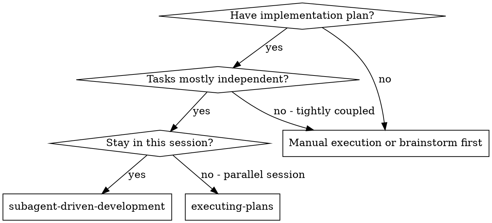
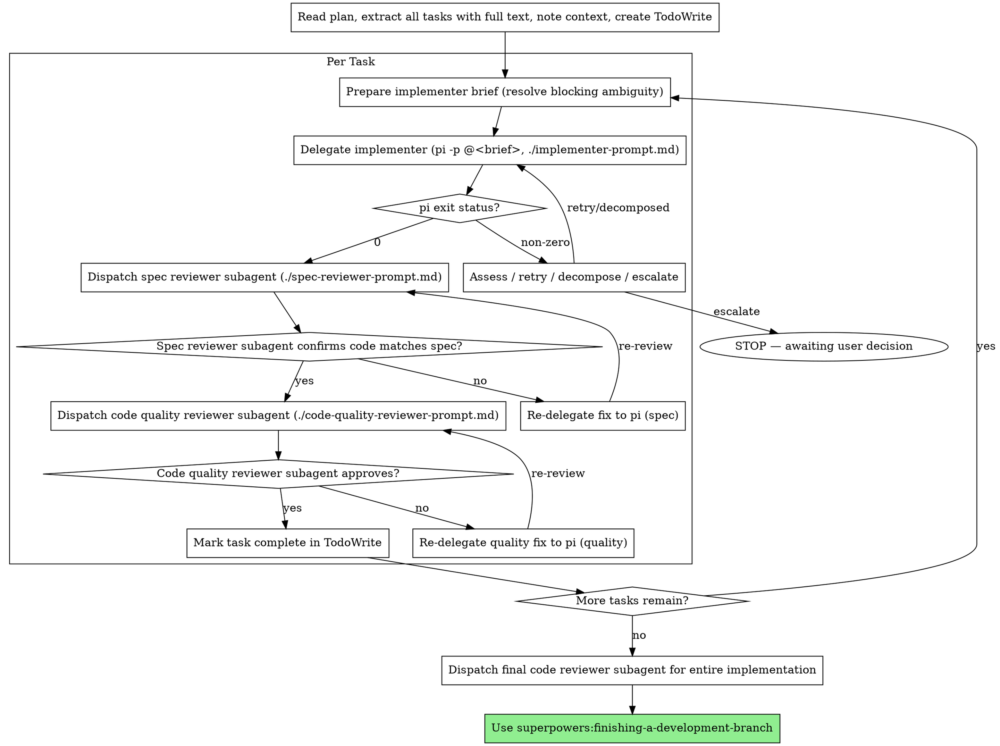

# Subagent-Driven Development

Execute plan by dispatching fresh subagent per task, with two-stage review after each: spec compliance review first, then code quality review.

**Why subagents:** You delegate tasks to specialized agents with isolated context. By precisely crafting their instructions and context, you ensure they stay focused and succeed at their task. They should never inherit your session's context or history — you construct exactly what they need. This also preserves your own context for coordination work.

**Core principle:** Fresh subagent per task + two-stage review (spec then quality) = high quality, fast iteration

**Continuous execution:** Do not pause to check in with your human partner between tasks. Execute all tasks from the plan without stopping. The only reasons to stop are: a pi delegation failure you cannot resolve after retry or decomposition, ambiguity that genuinely prevents progress, or all tasks complete. "Should I continue?" prompts and progress summaries waste their time — they asked you to execute the plan, so execute it.

## When to Use



**vs. Executing Plans (parallel session):**
- Same session (no context switch)
- Fresh subagent per task (no context pollution)
- Two-stage review after each task: spec compliance first, then code quality
- Faster iteration (no human-in-loop between tasks)

## The Process



## Model Selection

**Implementation:** Each task is a single pi delegation. There is no separate test author — pi writes the failing test, implements against it, and makes it green within one delegation. pi runs the user's locally configured model; this is a delegation transport, not a model choice.

**Review roles** still use Claude subagents. Use the most capable available model for spec compliance and code quality review — these roles require judgment and diff-reading that benefit from stronger reasoning.

## Right-Sizing Before Delegating

Delegate one task per delegation. Split a task on the fly only when it is genuinely huge — it bundles unrelated changes, or its "Done when" cannot be stated in a short paragraph. When you split, land the first sub-delivery (review + commit), then delegate the next, and update TodoWrite to reflect the sub-deliveries so progress stays accurate.

## Handling pi exit status

pi signals outcome via process exit code. Exit 0 → proceed to spec review. Non-zero → assess, retry once if transient, decompose if oversized, else escalate. See `./implementer-prompt.md` → "Handling pi exit status" for the canonical rule.

**Fix-loop context discipline:** When re-delegating after a reviewer finds issues, do not paste the original task plus the full review back to pi. Write a fresh, focused brief that names only the specific change required and the file(s) it affects. The reviewer's context belongs to you; pi only needs the next concrete action. If a single review surfaces multiple unrelated fixes, split them into separate delegations rather than batching. This guidance also lives in `./implementer-prompt.md` → "Fix-Loop Context Discipline".

## Reviewer Output Discipline

Reviewer subagents are not free — their replies sit in your context for the rest of the task. Both reviewer prompts (`./spec-reviewer-prompt.md` and `./code-quality-reviewer-prompt.md`) demand a terse, structured output format: a one-word verdict plus a bulleted issue list with `file:line` references. No strengths section, no recommendations, no preamble. Always use those prompts as written — don't ad-lib a verbose "review this task" dispatch, and don't ask follow-up questions that pull more reviewer prose into your context. If a verdict isn't clear from the structured reply, re-read the diff yourself rather than asking the reviewer to elaborate.

## Focused Re-Review After a Fix

When the implementer pushes a fix and you need the reviewer to confirm it, do **not** dispatch a fresh full review. Dispatch a focused re-review that:

1. Pastes the prior review's issue list verbatim.
2. Points the reviewer at the diff for the fix only (`git diff <SHA-before-fix>..HEAD`).
3. Asks one question: did each listed issue get resolved, yes or no, and are there regressions?

Both reviewer prompt files include a "Re-Review After a Fix" template — use it. Do not ask for a fresh full review just because you want a "second pass." Full re-reviews on every fix loop are how a single task's review context grows past pi's budget — and past your own working memory.

## Prompt Templates

- `./implementer-prompt.md` - Delegate an implementation task to pi (canonical invocation + exit-status rule)
- `./spec-reviewer-prompt.md` - Dispatch spec compliance reviewer subagent
- `./code-quality-reviewer-prompt.md` - Dispatch code quality reviewer subagent

## Example Workflow

```
You: I'm using Subagent-Driven Development to execute this plan.

[Read plan file once: docs/superpowers/plans/feature-plan.md]
[Extract all 5 tasks with full text and context]
[Create TodoWrite with all tasks]

Task 1: Hook installation script

[Brief prep: no blocking ambiguity — install path is explicit in the spec]
[Write brief to .pi-delegations/implementer-20260522T1400Z.md naming the plan and spec paths]
[Run: pi -p @.pi-delegations/implementer-20260522T1400Z.md]

pi exits 0:
  "Implemented install-hook command TDD-style. Added 5 tests, all passing. Committed."
[Verify with git status / git diff and run the tests yourself]

[Dispatch spec compliance reviewer]
Spec reviewer: ✅ Spec compliant - all requirements met, nothing extra

[Get git SHAs, dispatch code quality reviewer]
Code reviewer: Strengths: Good test coverage, clean. Issues: None. Approved.

[Mark Task 1 complete]

Task 2: Recovery modes

[Brief prep: ambiguity — spec says "report progress" but doesn't say how often]
[Ask user: "How often should progress be reported during recovery?"]
You: "Every 100 items"
[Write brief to .pi-delegations/implementer-20260522T1430Z.md; Notes section states "report every 100 items"]
[Run: pi -p @.pi-delegations/implementer-20260522T1430Z.md]

pi exits 0:
  "Added verify/repair modes with progress every 100 items. 8/8 tests passing. Committed."
[Verify with git status / git diff and run the tests yourself]

[Dispatch spec compliance reviewer]
Spec reviewer: ❌ Issues:
  - Missing: Progress reporting (spec says "report every 100 items")
  - Extra: Added --json flag (not requested)

[Write a focused fix brief: remove --json flag, add progress reporting per spec]
[Run: pi -p @.pi-delegations/implementer-20260522T1445Z.md]
pi exits 0:
  "Removed --json flag, added progress reporting every 100 items. Committed."

[Spec reviewer reviews again]
Spec reviewer: ✅ Spec compliant now

[Dispatch code quality reviewer]
Code reviewer: Strengths: Solid. Issues (Important): Magic number (100)

[Write a focused fix brief: extract magic number 100 to constant]
[Run: pi -p @.pi-delegations/implementer-20260522T1500Z.md]
pi exits 0:
  "Extracted PROGRESS_INTERVAL = 100 constant. Committed."

[Code reviewer reviews again]
Code reviewer: ✅ Approved

[Mark Task 2 complete]

...

[After all tasks]
[Dispatch final code-reviewer]
Final reviewer: All requirements met, ready to merge

Done!
```

## Advantages

**vs. Manual execution:**
- Delegates follow TDD naturally
- Fresh context per task (no confusion)
- Parallel-safe (delegations don't interfere)
- Each pi delegation starts a fresh session with a clean, intentional brief

**vs. Executing Plans:**
- Same session (no handoff)
- Continuous progress (no waiting)
- Review checkpoints automatic

**Efficiency gains:**
- Questions surfaced before work begins (not after)

**Quality gates:**
- Two-stage review: spec compliance, then code quality
- Review loops ensure fixes actually work
- Spec compliance prevents over/under-building
- Code quality ensures implementation is well-built

**Cost:**
- One pi delegation per task, plus 2 reviewer subagents
- Controller does more prep work (extracting all tasks upfront)
- Review loops add iterations
- But catches issues early (cheaper than debugging later)

## Red Flags

**Never:**
- Start implementation on main/master branch without explicit user consent
- Skip reviews (spec compliance OR code quality)
- Proceed with unfixed issues
- Delegate a genuinely huge task without splitting it first (it bundles unrelated changes, or its "Done when" can't be stated in a short paragraph)
- Leave genuine ambiguity unresolved before delegating (pi cannot ask questions)
- Stack the full review history into a fix-loop re-delegation instead of sending a focused fix brief
- Dispatch reviewers without the terse-output overrides from the prompt templates (verbose review output bloats every subsequent fix loop)
- Re-dispatch a fresh full review after a fix instead of the focused re-review (issue list + diff only)
- Accept "close enough" on spec compliance (spec reviewer found issues = not done)
- Skip review loops (reviewer found issues = implementer fixes = review again)
- Let pi's result summary replace actual review (both spec and quality review are required)
- **Start code quality review before spec compliance is ✅** (wrong order)
- Move to next task while either review has open issues

**If brief preparation reveals ambiguity:**
- Resolve from existing context if possible (don't ask the user unnecessarily)
- If you must ask the user, ask one question at a time
- State the resolution plainly in the brief — don't leave pi to guess

**If reviewer finds issues:**
- Re-delegate to pi with specific fix instructions
- Reviewer reviews again
- Repeat until approved
- Don't skip the re-review

**If pi delegation fails (non-zero exit):**
- Retry once for transient failures
- If it fails again, escalate to the user — don't re-delegate without changing something

## Integration

**Required workflow skills:**
- **superpowers:using-git-worktrees** - Ensures isolated workspace (creates one or verifies existing)
- **superpowers:writing-plans** - Creates the plan this skill executes
- **superpowers:requesting-code-review** - Code review template for reviewer subagents
- **superpowers:finishing-a-development-branch** - Complete development after all tasks

**Subagents should use:**
- **superpowers:test-driven-development** - Subagents follow TDD for each task

**Alternative workflow:**
- **superpowers:executing-plans** - Use for parallel session instead of same-session execution
